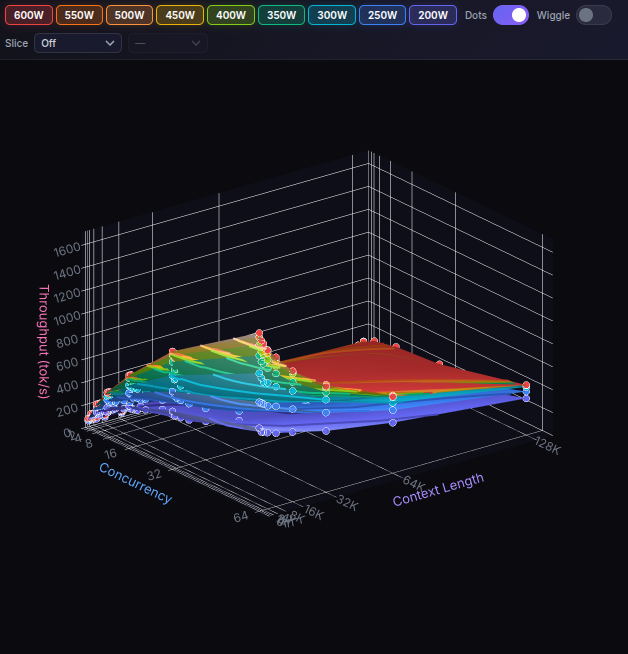

# Blackwell-Wattage-Performance

For those wondering which variant of the Nvidia RTX 6000 Pro they should buy, or how power limits affect performance... Here's an interactive 3D visualization of inference performance vs -pl and user concurrency. Minimax-m2.5-NVFP4 on 2x RTX 6000 Pro tested.

### [👉 Live Interactive 3D Visualization HERE](https://shihanqu.github.io/Blackwell-Wattage-Performance/)

---

### Features
- **3D Heatmap**: Compare throughput across concurrency and context length.
- **Wiggle Stereoscopy**: Enhanced depth perception via subtle camera oscillation.
- **Slicing**: Analyze cross-sections by user count, context length, or target throughput.
- **Interactive Toggles**: Show/hide specific power limits (200W–600W).

### Benchmarking Rig
- **GPUs**: 2× RTX PRO 6000 Blackwell
- **VRAM**: 192GB Total
- **Model**: MiniMax-M2.5-NVFP4
